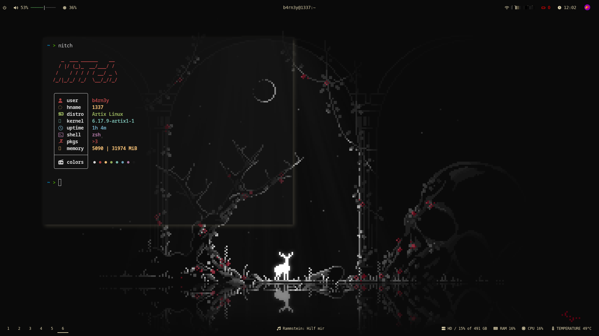

# Artix Linux i3 Rice

My personal **Artix Linux (runit)** rice focused on minimalism, performance, and a clean dark aesthetic.

## Environment
- **OS:** Artix Linux (runit)
- **WM:** i3wm
- **Bar:** polybar
- **Compositor:** picom
- **Launcher:** rofi
- **Terminal:** alacritty
- **Shell:** zsh
- **Lockscreen:** mantablockscreen

## Theme & Appearance
- **GTK Theme:** Adwaita
- **Cursor Theme:** WinSur-dark-cursors

## Repository Structure
```text
.config/
 ├── alacritty/
 ├── dunst/
 ├── mantablockscreen/
 ├── picom/
 ├── polybar/
 └── rofi/

.zshrc
.xinitrc
ricepicture.png

## Screenshot


